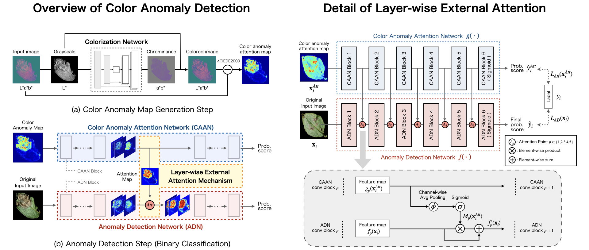

# LEA-Net : Layer-wise_External_Attention_Network

<!-- Badges -->
<p>
    
    
    
    
    
    
    
    
    
    
    
</p>

## Overview
<div align="center">
    
</div>
This page provides the implementation of LEA-Net (Layer-wise External Attention Network). The formative anomalous regions on the intermediate feature maps can be highlighted through layer-wise external attention. LEA-Net has a role in boosting existing CNN anomaly detection performances.

## Usage
### phase 1: Unsupervised Learning.
In this phase, images are reconstructed by various methods.
#### Setting up Dataset
Make sure that it follows the following data tree:
```
Dataset___Positive___image
        |          |_image
        |          |_Directory___image
        |               :      |_image
        |                          :
        |_Negative___image
                   :
```
train.py loads all images in the Positive/Negative directory.

#### Training Reconstruction model to make Anomaly Attention Map (AAN)
For example, you can run this sample code:
```
python phase1.py \
--GPU ${GPU_ID} --save_path ${SAVE_PATH} \
--dataset ${DATASET}  --task "colorization" --n_splits 10 \
--model "Unet" --loss "BCE" \
--batch_size 16 --epochs 10 \
--lr 1e-04
```


### phase 2: Supervised Learning.
In this phase, images are reconstructed by various methods.
#### Setting up Dataset
Please specify the output of phase 1. Make sure that it follows the following data tree:
```
Dataset___01___GT___Train___image1
        |    |    |       |_image2
        |    |    |           :
        |    |    |
        |    |    |_Test___image1
        |    |           |_image2
        |    |               :
        |    |
        |    |_Anomap___Train___image1
        |    |        |       |_image2
        |    |        |           :
        |    |        |
        |    |        |_Test___image1
        |    |               |_image2
        |    |                   :
        |    |
        |    |_Label.npz
        |
        |_02___...
        :
        |_'n_splits (phase1)'___...
```
#### Training Classifier model
For example, you can run this sample code:
```
python phase2.py \
--GPU  ${gpu_id} --save_path ${SAVE_PATH} \
--dataset ${DATASET} --n_splits 10 \
--input_method 'img_and_attMap' \
--output_method 'AAN_and_ADN' \
--model_ADN 'ResNet18' --model_AAN 'MobileNet' \
--attention_points 0 \
--batch_size 16 --epochs 100 --lr 1e-04 \
--epochs 3
```

## Performance
#### Effects of layer-wise external attention
Visualization of feature maps at attention points before and after the layer-wise external attention.

<div align="center">
    
</div>

The data in the figure can be downloaded from [PlantVillage Dataset](https://www.kaggle.com/datasets/emmarex/plantdisease) and [DR2](https://figshare.com/articles/dataset/Advancing_Bag_of_Visual_Words_Representations_for_Lesion_Classification_in_Retinal_Images/953671/3).